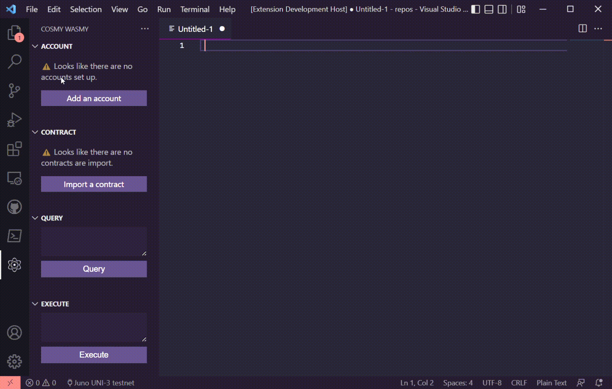
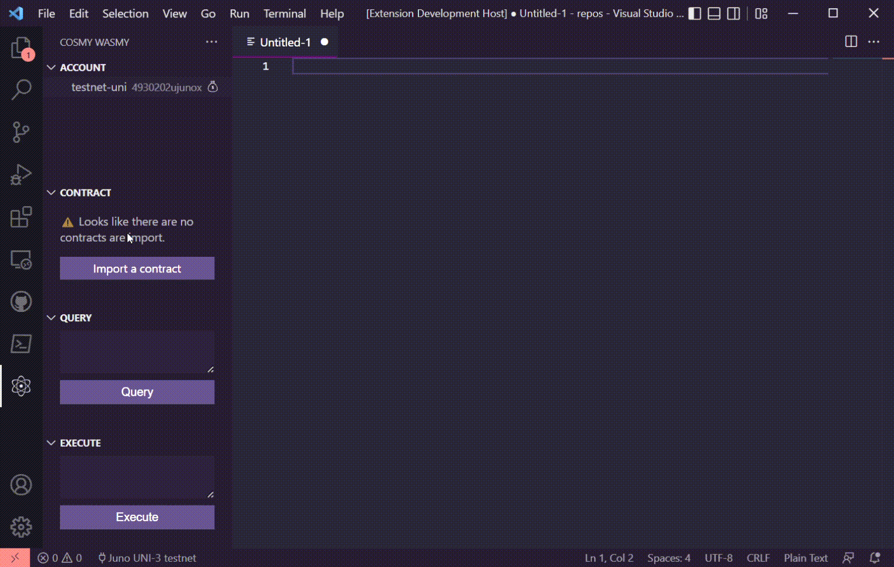
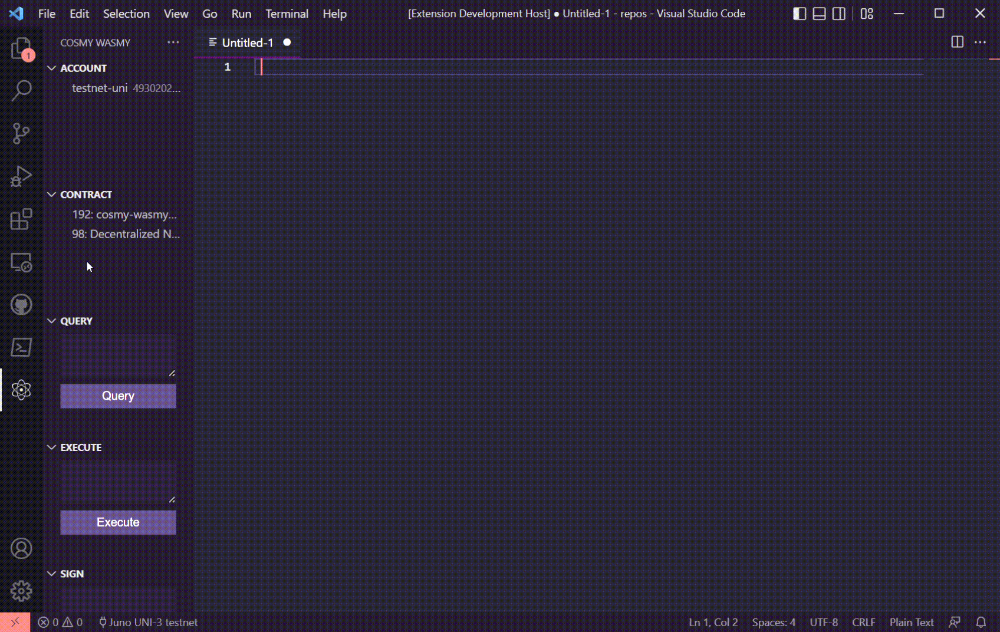
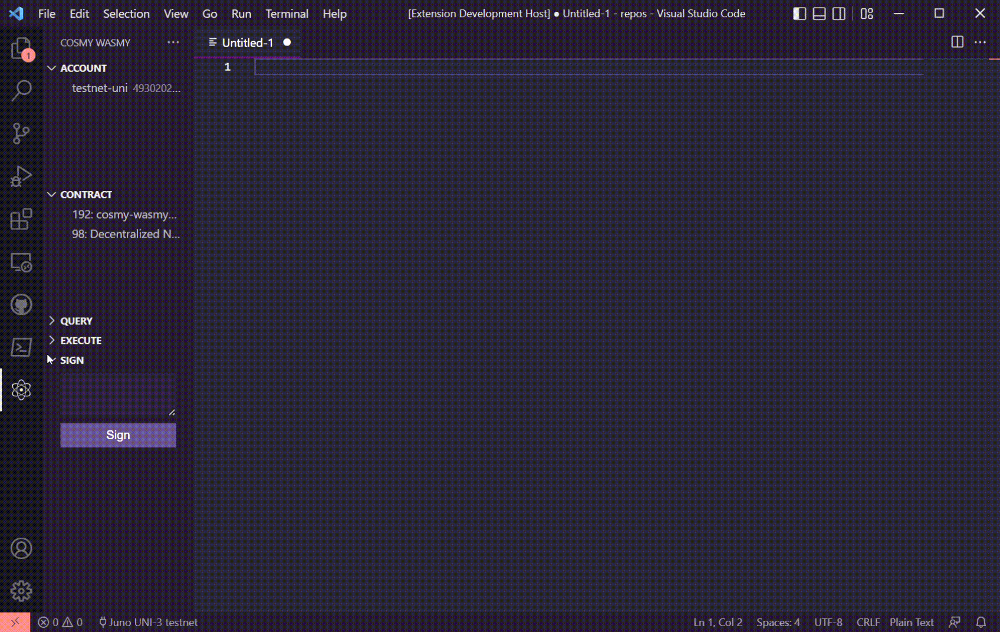

# cosmy-wasmy 

This extension allows you to interact with Cosmwasm contracts on local, testnet or mainnet chains

## Requirements

The version of vscode should be above `^1.67.0`

## Extension Settings

**[Juno uni-3 testnet](https://testnet.ping.pub/juno)** config and **[Juno Localnet](https://github.com/CosmosContracts/juno/pkgs/container/juno)** config is preset by default. Any other chain can be manually added.

You can set up the extension settings here 
> File > Preferences > Settings > Cosmy Wasmy

This extension contributes the following settings:
* `cosmywasmy.chainConfigName`: This setting is used to select which of the given Chain configs is to be used in this workspace. Default: _Juno UNI-3 testnet_ 
* `cosmywasmy.chains`: This settings stores an array of JSON objects which contans the Chain config details. Default: Includes _Juno UNI-3 testnet_ and _Juno Localnet docker_ settings.

    This setting can be expanded to include any localnet or testnet chains. (Mainnet not recommended)

    The structure of the expected setting:
    ```json
    [
        {
            "configName": "Juno UNI-3 testnet", // This need to match exactly the `cosmywasmy.chainConfigName` when the chain config needs to be selected
            "chainId": "uni-3", // The localnet/testnet Chain ID
            "addressPrefix": "juno", // Used to derive account address
            "rpcEndpoint": "https://rpc.uni.juno.deuslabs.fi", // Used for query and tx exec of smart contracts
            "defaultGasPrice": "0.025", // Gas price set for the smart contract tx execution
            "chainDenom": "ujunox" // the micro denom used to pay for gas and to track account balance
        }
    ]
    ```

## Features

### Account


Create new wallets with user-given seed phrase or an auto-generated seed phrase.
The seedphrases are stored in plaintext within vscode. `DO NOT USE YOUR ACTUAL WALLET SEED PHRASE WITH THIS EXTENSION`.

Once an account has been created, you can

1. Request funds from faucet (if it has been setup)
2. Copy address (derived from prefix from the settings)
3. Copy mnemonic
4. Delete the account from vscode

### Contract 



Import smart contracts from the chain by their contract address.

Once a contract has been imported, you can
1. Copy contract address
2. Delete the contract from vscode

### Query



Input the request query data and select the smart contract from the above view to query and the response/err will open on a new doc on the screen

### Execute


Input the request tx data and select the smart contract as well as the wallet account from the above view to sign and broadcast the transaction and the response/err will open on a new doc on the screen

### Sign



Input the text which needs to be signed and select the wallet account in the view above and the signature/err will open on a new doc on the screen

### Misc

1. Selected Chain


The currently selected chain is shown in the statur bar below.
In case, you need to change the network env, go to settings and change `cosmywasmy.chainConfigName` and then click on this status bar item to reload the config.

2. Reset Data


Go to the Command Palette (Windows: Ctrl+Shft+P, MacOS: 🤷🏻‍♀️, Linux: 🤷🏻‍♀️) and type `Reset Data`. This will erase all extension related information from vscode


## Warnings

*  The seedphrases are stored in plaintext within vscode. `DO NOT USE YOUR ACTUAL WALLET SEED PHRASE WITH THIS EXTENSION`

## Known Issues

* UI issue - When the Query, Execute, Sign views are collapsed and reopened again, the view component elements get wrong alignments.

## Release Notes

Find release notes in [CHANGELOG](CHANGELOG.md)