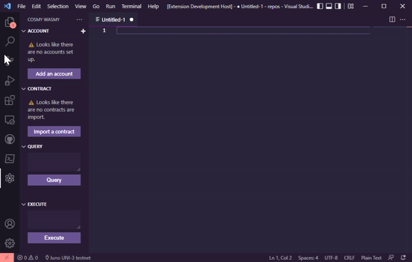
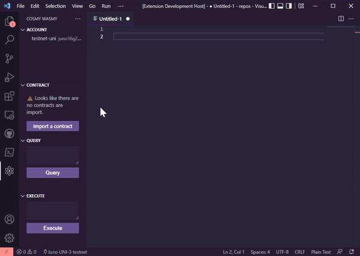

# Cosmy Wasmy

<p align="center">
<a href="https://marketplace.visualstudio.com/items?itemName=spoorthi.cosmy-wasmy">
    
</a>
</p>


[](https://github.com/spoo-bar/cosmy-wasmy/actions/workflows/codeql-analysis.yml)
[](https://github.com/spoo-bar/cosmy-wasmy/actions/workflows/gitopia-mirror.yml)


Cosmy Wasmy makes it easy to develop and interact with a [CosmWasm](https://github.com/CosmWasm/cosmwasm) smart contracts. With the most popular Cosmwasm chains testnets pre-configured, it makes chain interactions during testing super simple. You can perform all Cosmwasm interactions without touching the CLI.

Find release notes in [CHANGELOG](CHANGELOG.md)

---

## Table of Contents

* [Getting Started](#getting-started)
    * [Prerequisites](#prerequisites)
* [Installation](#installation)
* [Configuration](#configuration)
* [Commands](#commands)
* [Features](#features)
    * [Account](#account)
        * [Beaker Integration](#beaker-intergration)
    * [Contract](#contract) 
    * [Cosmwasm](#cosmwasm)
    * [Notebooks](#notebooks)
    * [Misc](#misc)
        * [Localization](#localization)
        * [Test Explorer](#test-explorer)
        * [Walkthroughs](#walkthroughs)
* [Thanks](#thanks)

---

## Getting Started

This section is intended to give you an introduction to using Cosmy Wasmy.

### Prerequisites

* [Rust](https://www.rust-lang.org/tools/install) for building cosmwasm contract
    * [Rustup](https://rustup.rs/) for dealing with wasm target
* [Docker](https://docs.docker.com/get-docker/) for running wasm rust-optimizer 
* [VSCode](https://code.visualstudio.com/) to install the extension in

#### Optional
* [rust-analyzer](https://marketplace.visualstudio.com/items?itemName=rust-lang.rust-analyzer) extension for vscode to provide syntax highlighting and other language server features

---
## Installation

You can install Cosmy Wasmy from the [visual studio marketplace](https://marketplace.visualstudio.com/items?itemName=spoorthi.cosmy-wasmy) 

Or, you can search for `Cosmy Wasmy` in vscode Extensions sidebar. 

> **Note**
>
> The extension provides Walkthroughs for the major features. You can access the walkthroughs by going to Command Palette (Windows: `Ctrl+Shft+P`, MacOS: `Cmd+Shft+P`, Linux: `Ctrl+Shft+P`) and selecting **"Welcome: Open Walkthrough"**.

Its recommended post installation to configure the extension for your use case. Here are the first few things you might wanna do.

1. Select your target chain

    The extension is pre-configured with some of the most popular CW-enabled chains. You can find more details in the [Configuration](#configuration) section.

    


2. Import accounts

    If you have any prior test accounts, you can import them by going to the Cosmy Wasmy sidebar and adding a new account in the Account view. Or you can choose to create a new account as well. 

    

    > **Warning**
    >
    > Do NOT use your mainnet account here. The mnemonic is stored in plain text within vscode

3. Import contracts

    Any contracts deployed on your target chain can be imported here with its address

    

4. Explore the settings

    Explore all the configurations available in the extension by going to `File > Preferences > Settings > Extensions > Cosmy Wasmy`. 

---

## Configuration

The following chains are pre-configured by default. Any other chains can be manually added in the settings.

|    | Project                               | Environment | ChainID       |
| -- | ------------------------------------- | ----------- | ------------- |
| 1 | [Osmosis](https://osmosis.zone/)       | testnet     | osmo-test-4   |
| 2 | [Juno](https://www.junonetwork.io/)    | testnet     | uni-6         |
| 3 | [Archway](https://archway.io/)         | testnet     | constantine-2 |
| 4 | [Stargaze](https://www.stargaze.zone/) | testnet     | elgafar-1     |
| 5 | [Neutron](https://neutron.org/)        | testnet     | baryon-1      |
| 6 | [Juno](https://www.junonetwork.io/)    | localnet    | testing       |
| 7 | [Osmosis](https://osmosis.zone/)       | localnet    | localosmosis  |
| 8 | [OKTC](https://www.okx.com/oktc)       | localnet    | exchain-67    |
| 9 | [OKTC](https://www.okx.com/oktc)       | testnet     | exchain-65    |

You can set up the extension settings at
> File > Preferences > Settings > Extensions > Cosmy Wasmy

| Setting | Type | Default  | Scope | Details |
| --------|------|----------|-------|---------|
| [Deprecated] ~~`cosmywasmy.chainConfigName`~~ | ~~string~~ | ~~Juno UNI-5~~ | ~~Workspace~~ | ~~This setting is used to select which of the given Chain configs is to be used in this workspace~~ |
| `cosmywasmy.chains`  | json   | *Refer above* | Application | Stores an array of JSON objects which contains the chain config details. <br />  The structure of the expected setting is elaborated below this table  |
| `cosmywasmy.contractSortOrder` | enum   | None | Workspace | Controls the sorting order of the Smart Contracts in the Contract view <br /> * Alphabetical - Sort by the label<br /> * CodeId - Sort by the Code ID<br /> * None - No explicit sorting - Maintains the order the contracts were imported in |
| `cosmywasmy.cosmwasmResponseView` | enum   | Terminal | Workspace | Controls where the smart contract responses should be displayed <br /> * NewFile - Open a new dummy doc with response <br /> * Terminal -  A separate output channel by Cosmy Wasmy in the Output view |
| `cosmywasmy.maxHistoryStored` | number | 20 | Workspace | Controls the latest number of queries and txs kept in history for easy re-execution. If set to `0` the feature is disabled and nothing is stored |
| `cosmywasmy.openTxExplorerInVscode` | bool | false | Workspace | Controls if tx should be opened in block explorer within vscode |
| `beaker.autosync` | bool | true | Machine | Controls if any accounts configured in Beaker.toml are automatically loaded into the extension |

The structure of the expected setting for `cosmywasamy.chains`:
```json
[
    {
        "configName": "Osmosis test-4", // A unique human friendly name for the chain
        "chainId": "osmo-test-4", // The localnet/testnet Chain ID
        "chainEnvironment": "testnet", // Is the chain localnet, testnet or (god forbid 😨) mainnet
        "addressPrefix": "osmo", // Used to derive account address
        "rpcEndpoint": "https://rpc-test.osmosis.zone", // Used for query and tx exec of smart contracts
        "defaultGasPrice": "0.025", // Gas price set for the smart contract tx execution
        "chainDenom": "uosmo", // the micro denom used to pay for gas and to track account balance
        "faucetEndpoint": "http://localhost:8000", //Faucet address and port to request funds
        "accountExplorerLink": "https://testnet.mintscan.io/osmosis-testnet/account/${accountAddress}", //Block explorer url which includes '${accountAddress}' text to generate account url
        "txExplorerLink": "https://testnet.mintscan.io/osmosis-testnet/txs/${txHash}" // Block explorer url which includes '${txHash}' text to generate tx url
    }
]
```
---

## Commands

These commands can be activated using View > Command Palette (Windows: Ctrl+Shft+P, MacOS: Cmd+Shft+P, Linux: Ctrl+Shft+P) 

All the given keybindings can be customized

| Title | Command | Keybinding | Details | 
|-----------------------|-------------------------|------------|---------| 
| Setup Dev Environment | cosmy-wasmy.setupDevEnv |   | Installs rust and cargo dependencies |
| Build                 | cosmy-wasmy.build  | ctrl+shift+b | Builds the project and generates the non-optimized wasm file | 
| Run Unit Tests        | cosmy-wasmy.runUnitTests     | ctrl+shift+t | Runs all the unit tests in the project | 
| Optimize Contract     | cosmy-wasmy.optimizeContract | ctrl+shift+o | Runs the docker contract-optimizer and generates an optimized wasm artifact - Needs docker running | 
| Generate Schema       | cosmy-wasmy.generateSchema | ctrl+shift+g | Generates json-schema using the Rust schema files. This enables autocomplete for the query and tx json | 
| Upload Contract       | cosmy-wasmy.upload         | ctrl+shift+u | Uploads a wasm file to selected chain with selected account. <br /> Right clicking on a wasm file shows this command in the context menu or command can be invocated using Command Palette/Key Binding and file dialog opens to select a wasm file <br /> Can also be invoked by clicking on the Upload icon in the Contract view | 
| Reload Chain Config   | cosmy-wasmy.reloadConfig   | | Opens a quick pick menu for the user to pick a new chain for the current workspace |
| Reset Data            | cosmy-wasmy.resetData      | | Deletes all the extension stored data, like accounts and contracts. | 
| Show Cosmwasm History | cosmy-wasmy.history | ctrl+shift+a | Shows latest queries and transactions and with saved inputs. Allows easy re-execution of same queries. The number of saved queries is configurable in the settings. | 
| Export Cosmy Wasmy data | cosmy-wasmy.export |  | Export imported accounts, all imported contracts and history as a JSON file. Careful sharing this file with others as it will include your seed phrase | 
| Create a new CW Notebook | cosmy-wasmy.createCwNotebook |   | Create a new CW Notebook with some sample content |

---

## Features

### Account

Create new wallets with user-given seed phrase or an auto-generated seed phrase. 

> **Warning**
>
> Do NOT use your mainnet account here. The mnemonic is stored in plain text within vscode

Once an account has been created, you can do the following actions

* Request funds from faucet (if [@cosmjs/faucet](https://www.npmjs.com/package/@cosmjs/faucet) compatible faucet has been set up)
* Copy address to clipboard

    The address is derived from prefix from the current active chain config

* Copy mnemonic or seed phrase to clipboard
* Delete the account from vscode 

    The address and funds persists on-chain.

* Open in Block Explorer (if `accountExplorerLink` has been set up for currently active chain)

If you see an account balance as `NaN`, it probably means your RPC endpoint is not reachable. Ensure the endpoint is reachable and run `cosmy-wasmy.refreshAccount` to fetch the account balances.

#### Beaker Integration

If your settings have been configured such that `beaker.autosync` is enabled, all the accounts and chain configurations from the `Beaker.toml` will be imported into the extension. 

Alternatively, you can also right-click and on a `Beaker.toml` file and select "Sync Beaker Config" to manually sync the accounts and chain configs.

> **Note**
> Ensure the Beaker.toml is present in the root of your repository for auto-sync.


### Contract

Any contracts deployed on-chain, can be imported by their contract address so that they can be interacted with using the extension. Only contracts which were imported with the current active chain are displayed.

Once a contract has been imported, you can do the following from the context menu

* Copy contract address
* View contract checksum from chain
* Download contract binary from chain

    The contract is saved in the root of the repository with name `{contractAddress}.wasm`
* Delete the contract from vscode 
    
    The contract and its state persists on-chain.

* Change the contract admin 

    Changes the cosmwasm admin, not any admin set up by the contract itself

* Remove the contract admin 

    Changes the cosmwasm admin, not any admin set up by the contract itself

* Add notes and comments

     Developer can add some notes and comments about the smart contracts which will be saved locally in the extension. Its not connected to any on-chain or cosmwasm feature. It is just for a developer's self reference. This information is shown when the user hovers on the contract in the view. Markdown as well as [codicons](https://microsoft.github.io/vscode-codicons/dist/codicon.html) are supported in the comments.


    

> **Note**
>
> If any imported contract has a disconnected plug icon next to it, it implies that the contract was imported before v1.0.0 of the extension came out and the extension does not have the relevant information as to which chain config it was imported with. You can delete the contract and reimport it to set it up right

### Cosmwasm

The following Cosmwasm related interactions are possible with the help of the extension

* Query

    * Input the JSON request query data and select the smart contract from the above view to query and the response/err will be output. The historical queries are also stored and can be accessed by `Show Cosmwasm History` command for easy re-execution.

    * OR, Open a JSON file, and click on the `Run Query` button.

* Execute

    * Input the JSON request tx data and select the smart contract as well as the wallet account from the above view to sign and broadcast the transaction and the response/err will be output. You can also send any funds from your wallet for the msg execution as well. The historical txs are also stored and can be accessed by `Show Cosmwasm History `command for easy re-execution.

    * OR, Open a JSON file, and click on the `Execute Tx` button.

* Sign

    Input the text which needs to be signed and select the wallet account in the view above and the signature/err will be output

* Migrate

    Input the JSON request migrate data and select the smart contract as well as the wallet account from the above view to sign and broadcast the transaction and the response/err will be output

* Initialize

    Specify the Code Id of the uploaded contract wasm and provide a label for the smart contract. Include any JSON initialization information needed and select the wallet account from the account view to sign and broadcast the transaction and the response/err will be output. You can also send any funds needed by the contract for the initialization.

    The selected account will be set as admin for the contract.

* Upload

    You can also upload a wasm file to selected chain with selected account.

    Right clicking on a wasm file shows this command in the context menu or right clicking on the tab of the currently open wasm file shows this command in the context menu or command can be invoked using Command Palette/Key Binding and file dialog opens to select a wasm file.

* Simulate

    Right clicking on a wasm file shows you the command to Load the contract in Virtual Machine. Click on this and you will get access to the contract simulation view. You can instantiate the contract multiple times. Run queries against the contract as well as execute messages. You can view the event history of the VM as well.

    The inputs for the contract might be pre-populated based on the schema found in the repository. But thats just a suggestion. You can input arbitrary json into the simulations.

### Notebooks

Th extension now supports CosmWasm Notebooks. Any file stored with the file extension  `*.cwnotebook` is treated as a CW Notebook. CW Notebooks are similar to Jupyter notebooks where you can store in snippets of code in the middle of notebook documentation. 

In the notebook you can configure a contract binary and its schema in TOML block as given below
```toml
[config]
contract-url = "https://../contract.wasm"
schema-url = "https://../contract.json"
```
Any contract interactions in the notebook will be run against this contract. The contract is loaded into a CW virtual machine. 

To use the notebook, first execute the TOML block and then you can run the instantiate json and then the contract has been setup in the VM to be used for query and msg executions.


You can use as many markdown or JSON blocks in the notebook as needed. However, there should be only one TOML block with the contract configuration.


### Misc

#### Localization

The extension has localization support enabled. However, it is currently only available in English. You can choose to contribute other languages. You can find more details on how to do that in [CONTRIBUTING.md](./CONTRIBUTING.md)

#### Test Explorer

The extension does not implement any Rust language features as it is recommended to use the [rust-analyzer](https://marketplace.visualstudio.com/items?itemName=rust-lang.rust-analyzer) extension. However, the `rust-analyzer` extension does not provide Test Explorer features yet. This has been implemented such that native vscode Test Explorer will identify any Cosmwasm tests in your code and you can run your tests from there.

#### Walkthroughs

The extension provides Walkthroughs for the major features. You can access the walkthroughs by going to Command Palette (Windows: `Ctrl+Shft+P`, MacOS: `Cmd+Shft+P`, Linux: `Ctrl+Shft+P`) and selecting **"Welcome: Open Walkthrough"**

There are five walkthroughs available:
1. Getting Started with Cosmy Wasmy
2. Cosmy Wasmy: Accounts
3. Cosmy Wasmy: Contracts
4. Cosmy Wasmy: CW Notebooks
5. Cosmy Wasmy: Cosmwasm Interactions

It is recommended to run through them as they provide detailed information on how to use the extension.

---

## Thanks 

Big shoutout to [aswever](https://github.com/aswever), early feature inspirations for the extension came from [cosmwasm.tools](https://cosmwasm.tools/).

Another shoutout to [
TERRAN.ONE](https://twitter.com/terran_one) team for building the [cw-simulate](https://github.com/Terran-One/cw-simulate) library. 

Thanks to [Osmosis Grants](https://grants.osmosis.zone/) for funding the work for the v2 release of the extension.

And the consistent support I have found in the Cosmos and Cosmwasm community which motivates me to work on this extension 💜

If you would like to support this extension, you can:

1. Create issues for any bugs you encounter [here](https://github.com/spoo-bar/cosmy-wasmy/issues/new?assignees=spoo-bar&labels=&template=bug_report.md&title=)

2. Share what features you might be interested  [here](https://github.com/spoo-bar/cosmy-wasmy/issues/new?assignees=&labels=&template=feature_request.md&title=)

3. [Contribute](./CONTRIBUTING.md) to the extension - PRs are always welcome

4. Share the extension with other devs 💜

5. If you would like to support me ([spoo-bar](https://www.spoorthi.dev)) directly, you can DM me compliments on [Twitter](https://twitter.com/spoo_bar).


