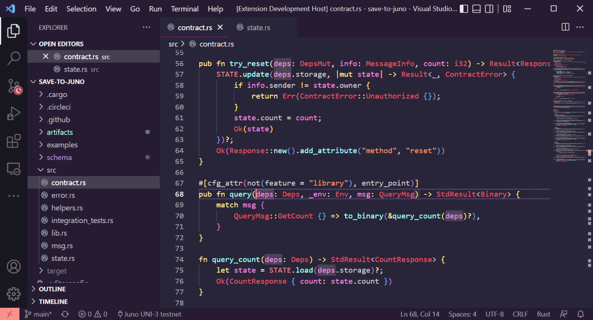
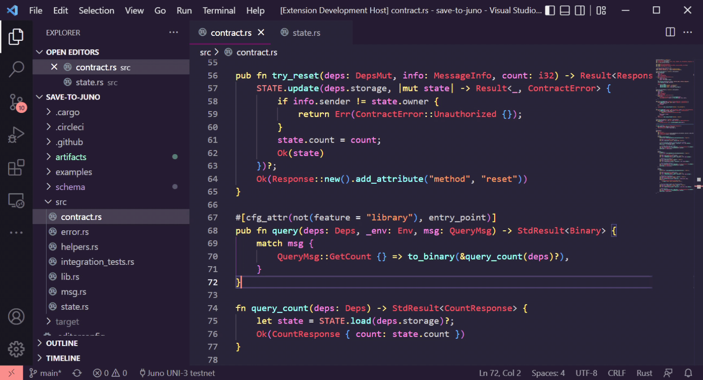
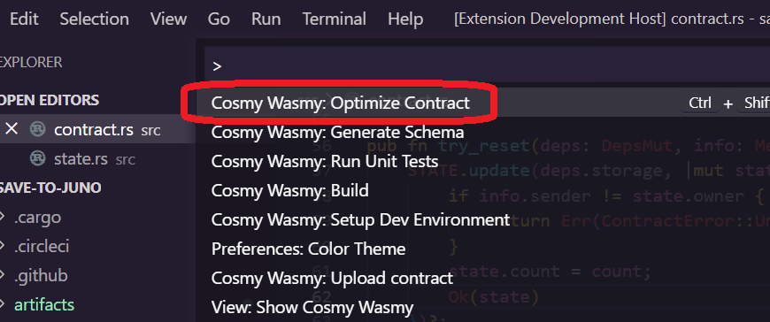
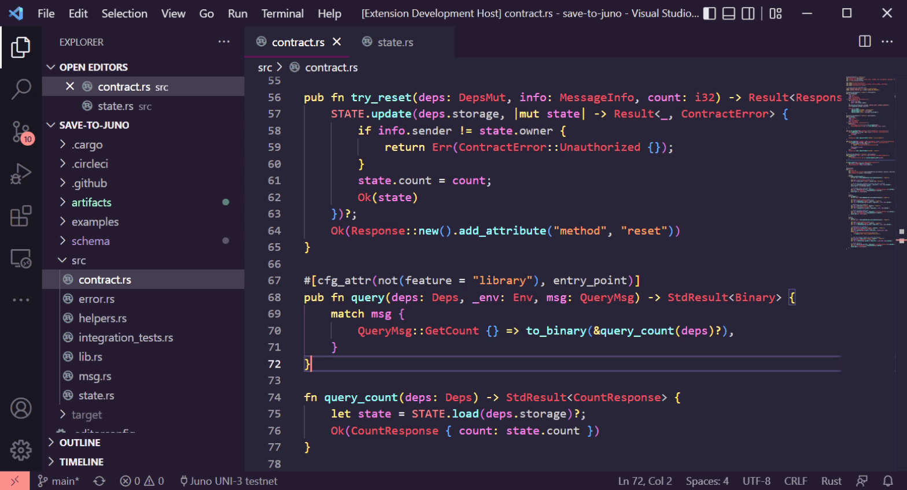
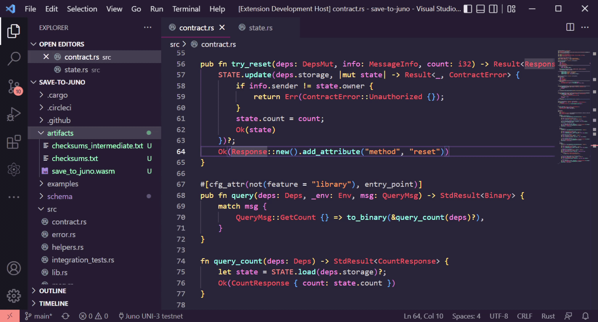
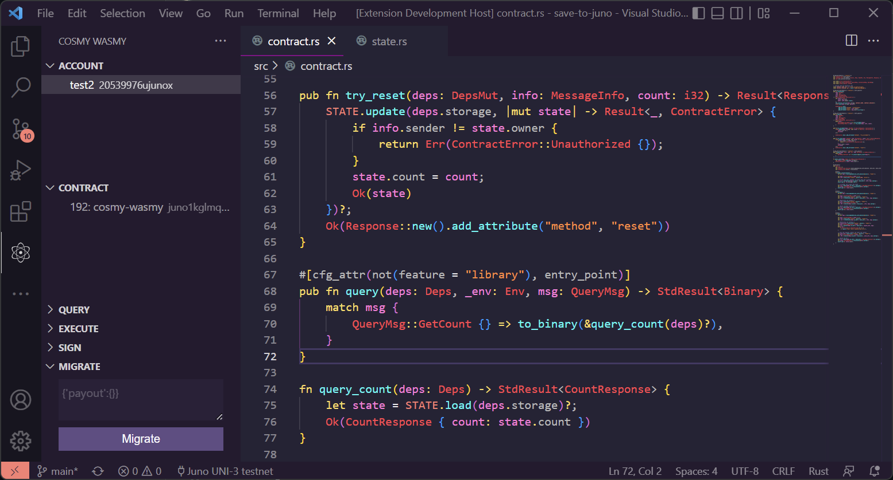
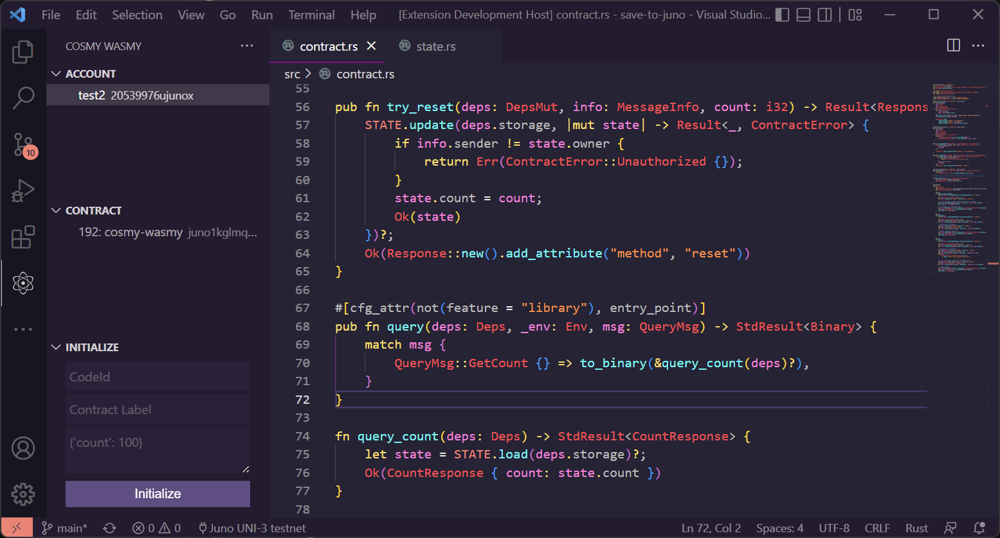

# cosmy-wasmy 

This extension allows you to interact with Cosmwasm contracts on local, testnet or mainnet chains

## Requirements

The version of vscode should be above `^1.67.0`

## Extension Settings

**[Juno uni-3 testnet](https://testnet.ping.pub/juno)** config and **[Juno Localnet](https://github.com/CosmosContracts/juno/pkgs/container/juno)** config is preset by default. Any other chain can be manually added.

You can set up the extension settings here 
> File > Preferences > Settings > Cosmy Wasmy


| Setting | Type | Default  | Scope | Details |
| --------|------|----------|-------|---------|
| `cosmywasmy.chainConfigName` | string | Juno UNI-3 testnet | Workspace | This setting is used to select which of the given Chain configs is to be used in this workspace |
| `cosmywasmy.chains`  | json   | Juno UNI-3 testnet and Localnet - Juno config | Application | This setting stores an array of JSON objects which contains the Chain config details. <br /> This setting can be expanded to include any localnet or testnet chains (mainnet not recommended). <br/> The structure of the expected setting is elaborated below this table  |
| `cosmywasmy.contractSortOrder` | enum   | None | Workspace | This setting controls the sorting order of the Smart Contracts in the Contract view <br /> * Alphabetical - Sort the Smart Contracts alphabetically by their label<br /> * CodeId - Sort the Smart Contracts by the Code ID<br /> * None - No explicit sorting - Maintains the order the contracts were imported in |
| `cosmywasmy.cosmwasmResponseView` | enum   | Terminal | Workspace | This setting controls where the smart contract interactions should be displayed <br /> * NewFile - Open a new dummy doc with response <br /> * Terminal -  A seperate output channel by Cosmy Wasmy in the Output view |


The structure of the expected setting for `cosmywasamy.chains`:
```json
[
    {
        "configName": "Juno UNI-3 testnet", // This need to match exactly the `cosmywasmy.chainConfigName` when the chain config needs to be selected
        "chainId": "uni-3", // The localnet/testnet Chain ID
        "addressPrefix": "juno", // Used to derive account address
        "rpcEndpoint": "https://rpc.uni.juno.deuslabs.fi", // Used for query and tx exec of smart contracts
        "defaultGasPrice": "0.025", // Gas price set for the smart contract tx execution
        "chainDenom": "ujunox" // the micro denom used to pay for gas and to track account balance
    }
]
```

## Commands

These commands can be activated using View > Command Palette (Windows: Ctrl+Shft+P, MacOS: 🤷🏻‍♀️, Linux: 🤷🏻‍♀️) 

All the given keybindings can be customized

| Title | Command | Keybinding | Details | Screenshot |
|-------|---------|------------|---------| ---------- |
| Setup Dev Environment | cosmy-wasmy.setupDevEnv |   | Installs rust and cargo dependencies |  |
| Build                 | cosmy-wasmy.build  | ctrl+shift+b | Builds the project and generates the initial wasm file |  |
| Run Unit Tests        | cosmy-wasmy.runUnitTests     | ctrl+shift+t | Runs all the unit tests in the project | |
| Optimize Contract     | cosmy-wasmy.optimizeContract | ctrl+shift+o | Runs the docker contract-optimizer and generates a small wasm artifact - Needs docker running |  |
| Generate Schema       | cosmy-wasmy.generateSchema | ctrl+shift+g | Generates json-schema using the Rust schema files |  |
| Upload Contract       | cosmy-wasmy.upload         | ctrl+shift+u | Uploads a wasm file to selected chain with selected account. <br /> Right clicking on a wasm file shows this command in the context menu or command can be invocated using Command Palette/Key Binding and file dialog opens to select a wasm file |  |
| Reload Chain Config   | cosmy-wasmy.reloadConfig   | | This reloads the currently active chain config. Use this when you switch between different networks within same workspace |  |
| Reset Data            | cosmy-wasmy.resetData      | | Deletes all the extension stored data, like accounts and contracts. |   |

## Features

### Account

Create new wallets with user-given seed phrase or an auto-generated seed phrase.
The seedphrases are stored in plaintext within vscode. `DO NOT USE YOUR ACTUAL WALLET SEED PHRASE WITH THIS EXTENSION`.

Once an account has been created, you can

1. Request funds from faucet (if it has been setup)
2. Copy address (derived from prefix from the settings)
3. Copy mnemonic
4. Delete the account from vscode


### Contract 

Import smart contracts from the chain by their contract address.

Once a contract has been imported, you can
1. Copy contract address
2. Delete the contract from vscode


### Query

Input the request query data and select the smart contract from the above view to query and the response/err will be output


### Execute

Input the request tx data and select the smart contract as well as the wallet account from the above view to sign and broadcast the transaction and the response/err will be output


### Sign

Input the text which needs to be signed and select the wallet account in the view above and the signature/err will be output


### Migrate

Input the request migrate data and select the smart contract as well as the wallet account from the above view to sign and broadcast the transaction and the response/err will be output



### Initialize

Specify the codeId of the uploaded contract wasm and provide a label for the smart contract. Also include any initialization information needed and select teh wallet account from the account view to sign and broadcast the transaction and the response/err will be output




## Snippets

Three built-in snippet shortcuts are available with the extension. Below you can see what snippet they generate.
Just type the highlighted text and vscode will provide a dropdown to insert the below snippet

### `admin` - Admin Check 
```rust
let admin = ADMIN.load(deps.storage)?;
if Some(info.sender) != admin {
   return Err(ContractError::Unauthorized {});
}
```

### `query` - New Query Function

```rust
fn query_do_something(deps: Deps) -> StdResult<SomeResponse> {
   let state = STATE.load(deps.storage)?;
   // ... insert logic here ...
   Ok(SomeResponse { })
}
```

### `tx` || `msg` - New Msg/Tx Function

```rust
pub fn try_something(deps: DepsMut, info: MessageInfo) -> Result<Response, ContractError> {
   STATE.update(deps.storage, |mut state| -> Result<_, ContractError> {
       if info.sender != state.owner {
           return Err(ContractError::Unauthorized {});
       }
       // ... insert logic here ...
       Ok(state)
   })?;
   Ok(Response::new().add_attribute("method", "try_something"))
}
```


## Warnings

*  The seedphrases are stored in plaintext within vscode. `DO NOT USE YOUR ACTUAL WALLET SEED PHRASE WITH THIS EXTENSION`

## Known Issues

*  The extension has only been tested in Windows environment and Ubuntu via WSL2. However, there is no reason it shouldn't work in native Linux or mac. Please create an issue if the extension doesnt behave the way expected


## Release Notes

Find release notes in [CHANGELOG](CHANGELOG.md)